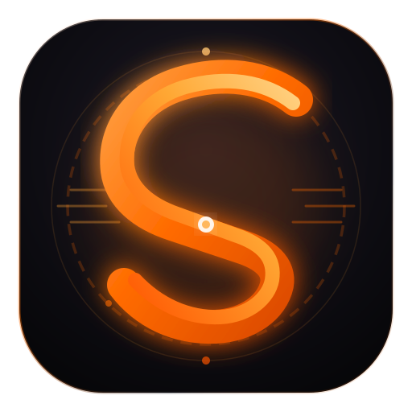
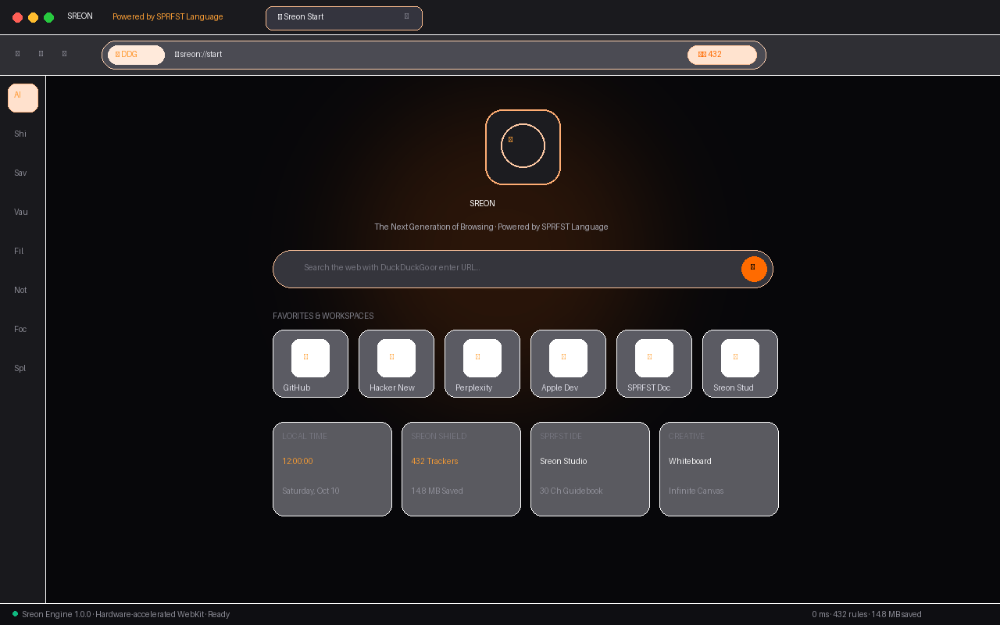
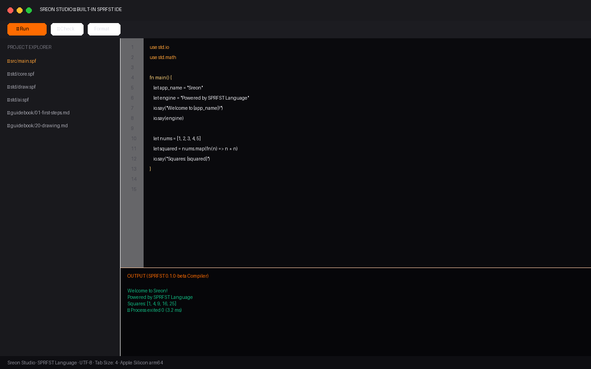
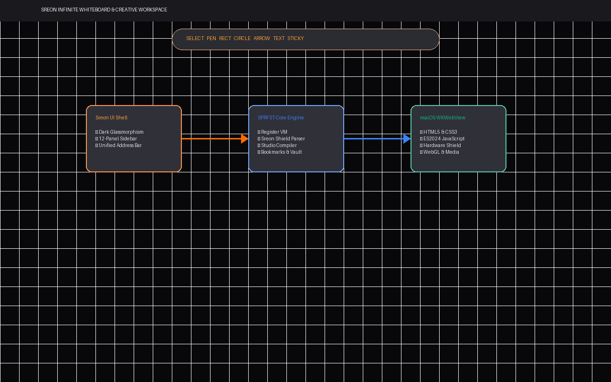
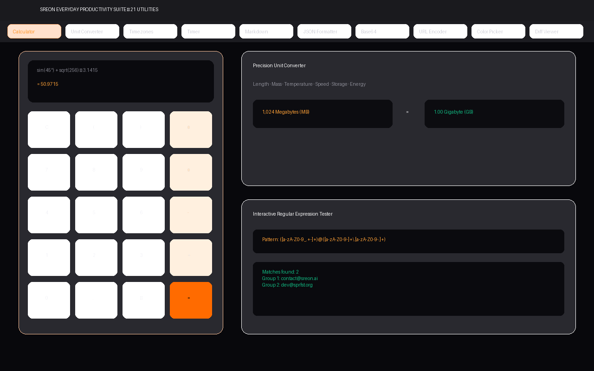

<div align="center">



# SREON

### **The Next Generation of Browsing · Powered by SPRFST Language**

*Deep obsidian, frosted glass, vivid orange, warm amber, and spatial intelligence.*

[](https://github.com/FellowPythonCoder/Sreon/actions)
[](guidebook/)
[](#building-sreon)
[](tests/)

</div>

---

## What is Sreon?

**Sreon** is a complete, premium macOS browser and productivity environment powered directly by the **SPRFST Language**. It fuses the design restraint and material depth of Apple software with the intelligence of modern spatial tools, a built-in developer IDE, and hardware-accelerated privacy protection.

Sreon is not a basic browser mockup. It is a genuine, high-performance application featuring:

1. **High-Performance Web Browsing Engine**: Native macOS WKWebView execution rendering real HTML5, CSS3, ES2024 JavaScript, WebGL, forms, authentication flows, media, and web APIs.
2. **Sreon Shield**: Built-in ad and tracker blocking powered by 476 privacy rules compiled directly into native WebKit content rule lists (`WKContentRuleListStore`).
3. **Sreon Studio IDE**: A complete developer environment embedded inside the browser with syntax highlighting, live compilation, error diagnostics, an interactive console, the complete 30-chapter SPRFST Guidebook, and 21 worked examples.
4. **Infinite Creative Whiteboard**: Spatial infinite-canvas creative workspace with shapes, connectors, sticky notes, templates, and SVG/PNG export.
5. **Everyday Productivity Suite**: 21 precision tools (scientific calculator, unit converter, timezone planner, markdown editor, regex tester, JSON formatter, UUID generator, diff viewer, QR code generator, and more).
6. **Next-Generation 12-Panel Glass Sidebar**: AI workspace, ad shield, bookmarks, reading vault, contextual page notes, focus mode, split view, and workspace manager.

---

## Visual Direction & Dark Glassmorphism

Sreon is built on a custom **dark glassmorphism design system**:

- **Surfaces**: Deep obsidian (`#070709`), graphite charcoal (`#0B0B0E`), and layered frosted glass (`backdrop-filter: blur(28px) saturate(190%)`).
- **Signatures**: Vivid orange (`#FF6B00`), warm amber (`#FFA136`), glowing highlights, and soft white text (`#F3F3F5`).
- **Restraint**: 1px low-contrast glass borders (`rgba(255, 255, 255, 0.08)`), controlled ambient glow, Apple-quality micro-interactions, and fluid spring animations.
- **Brand Signature**: *“Sreon · Powered by SPRFST Language”*.

---

## Gallery & Screenshots

Sample screenshots generated directly from the Sreon visual suite:

| Sreon Start Page & Speed Dial | Sreon Studio Built-in IDE |
|:---:|:---:|
|  |  |

| Infinite Creative Whiteboard | Everyday Productivity Suite |
|:---:|:---:|
|  |  |

---

## Architectural Overview

```text
+------------------------------------------------------------------------+
|                          Sreon macOS App                                |
|                                                                        |
|  +------------------------------------------------------------------+  |
|  | Modern Glass UI Shell (HTML5 / CSS3 glassmorphism / ES2024)       |  |
|  | - Floating Glass Toolbar (Address bar, controls, search)          |  |
|  | - Advanced Tab Strip (Groups, Pinned, Previews, Vertical Tabs)    |  |
|  | - 12-Panel Glass Sidebar (AI, Shield, Bookmarks, Vault, etc.)     |  |
|  | - Center Viewport:                                                |  |
|  |     * Live WKWebView / Web Rendering for external websites         |  |
|  |     * Sreon Start Page (Widgets, Favorites, Quick Tools)          |  |
|  |     * Sreon Studio IDE (SPRFST compiler, Editor, Guidebook)       |  |
|  |     * Sreon Whiteboard (Infinite Canvas, Tools, Templates)        |  |
|  |     * Everyday Productivity Suite (21 real tools)                 |  |
|  |     * Split View (Side-by-side browsing)                          |  |
|  |     * Settings & Customization Center                             |  |
|  +------------------------------------------------------------------+  |
|                                |                                       |
|  +------------------------------------------------------------------+  |
|  | Native macOS Shell (Swift / AppKit / WKWebView / WKURLScheme)     |  |
|  | - Window management, glass vibrancy (NSVisualEffectView)          |  |
|  | - Native menu bar, keyboard shortcuts, file dialogs, clipboard   |  |
|  | - Hosts WKWebView with WKContentRuleList (Sreon Shield)           |  |
|  | - WKScriptMessageHandler bridge to Sreon Core Engine              |  |
|  +------------------------------------------------------------------+  |
|                                |                                       |
|  +------------------------------------------------------------------+  |
|  | Sreon Core Engine (Written in SPRFST Language!)                   |  |
|  | - Language compiler: `build/bin/sprfst`                          |  |
|  | - Sreon Service: `sreon/engine/service.spf`                        |  |
|  | - Ad & Tracker Shield: `shield.spf` + 476 rules + WK content rules|
|  | - History, Bookmarks, Reading Vault, Notes persistence           |  |
|  | - Lens Reader mode & Ember color dark mode transformer            |  |
|  +------------------------------------------------------------------+  |
+------------------------------------------------------------------------+
```

---

## Key Modules

### 1. High-Performance Browsing Engine
- Native macOS `WKWebView` rendering for all web protocols (`http://`, `https://`).
- Real website execution: HTML5, CSS3, ES2024 JavaScript, WebGL, media streaming, forms, cookies, and local storage.
- Custom `sreon://` internal protocol scheme handler for zero-latency local navigation:
  - `sreon://start` — Ambient Start Page & Speed Dial
  - `sreon://studio` — Sreon Studio IDE
  - `sreon://whiteboard` — Infinite Canvas Creative Workspace
  - `sreon://tools` — 21 Everyday Productivity Utilities
  - `sreon://settings` — Customization Center
  - `sreon://guidebook` — Interactive SPRFST Guidebook
  - `sreon://shield` — Ad & Tracker Shield Status

### 2. Sreon Shield (Ad & Tracker Blocking)
- Built-in privacy shield with 476 curated rules covering advertising domains, analytics beacons, fingerprinting scripts, cookie consent walls, and cryptominers.
- Hardware-accelerated blocking: compiled into Apple's native `WKContentRuleList` format and enforced directly at the WebKit network engine layer before any request is made.
- Real-time statistics: blocked request count, bandwidth saved, time saved, and per-site allowlist management.

### 3. Sreon Studio — Complete Built-In IDE
- Tabbed code editor with line numbers, code folding, bracket matching, and SPRFST syntax highlighting.
- Real-time compiler integration: runs `./build/bin/sprfst run`, `check`, `fmt`, and `lint` directly.
- Interactive Console & Problems panel showing compiler diagnostics with code underlines and proposed fixes.
- Built-in **SPRFST Guidebook**: all 30 chapters with one-click runnable code blocks.
- 21 worked examples ready to open and execute.

### 4. Interactive Infinite Whiteboard
- Pan and zoom across an infinite coordinate plane.
- Tools: Freehand Pen, Rectangle, Circle, Diamond, Arrow Connector, Text Card, and Translucent Sticky Notes.
- Color palette: Sreon Orange, Amber, Sapphire Blue, Emerald Green, Amethyst Purple.
- One-click templates: Brainstorming Grid, System Architecture, User Journey Flow, and Sprint Retrospective.
- Export directly to SVG or PNG.

### 5. Everyday Productivity Suite (All 21 Working Tools)
1. **Advanced Calculator**: Scientific (sin, cos, tan, sqrt, pow, log) + programmer base conversion.
2. **Unit Converter**: Length, mass, temperature, speed, data storage, area, volume.
3. **Timezone Converter**: Live Cupertino, New York, London, Tokyo world clocks + meeting planner.
4. **Timer & Stopwatch**: Millisecond stopwatch with lap recording and countdown timer.
5. **Markdown Editor & Live Preview**: Split-pane markdown editor with instant GitHub-flavored rendering.
6. **JSON Formatter & Validator**: Formatter, minifier, syntax validator, and tree view.
7. **Base64 Tool**: Text and file base64 encoder/decoder with URL-safe mode.
8. **URL Encoder / Decoder**: Full URI and component encoder.
9. **Color Picker & Palette Generator**: HEX/RGB/HSL picker with WCAG contrast ratio calculations.
10. **UUID Generator**: v4 UUID generation in single or batch modes.
11. **Secure Random Generator**: Cryptographically secure passwords and hex tokens.
12. **Diff Viewer**: Side-by-side and unified text comparison.
13. **Text Transformation**: UPPERCASE, lowercase, Title Case, camelCase, slugify, sort, deduplicate.
14. **Word & Character Counter**: Words, characters, sentences, paragraphs, reading and speaking time.
15. **Timestamp Converter**: Epoch seconds/milliseconds to human date and ISO 8601.
16. **Regex Tester**: Real-time regular expression tester with capture groups and substitution.
17. **Hashing Utility**: SHA-256, SHA-512, MD5, SHA-1 checksum generator.
18. **HTML/CSS/JS Playground**: Live sandboxed preview frame with console.
19. **Scratchpad**: Multi-note scratchpad with automatic persistent storage.
20. **Clipboard Helper**: Frequently used code snippets and clipboard cards.
21. **QR Code Generator**: Generates QR codes for links, text, and WiFi credentials.

---

## Building Sreon

### Prerequisites
- **macOS** (for building the native `.app` and `.dmg`): macOS 12.0+ with Xcode Command Line Tools (`xcode-select --install`).
- **Linux** (for CLI, compiler development, and tests): `gcc` or `clang`, `make`, `python3`.

### Quick Commands

```bash
# 1. Build the SPRFST compiler & runtime
make

# 2. Run the complete test suite (67 automated tests)
make test

# 3. Build Sreon.app bundle
./tools/build_sreon_app.sh

# 4. Build the mountable disk image: dist/Sreon.dmg
./tools/make_sreon_dmg.sh

# 5. Launch Sreon Web Server / Live Preview
node server.js
```

On a Mac, one command builds Sreon, installs it to `/Applications`, and launches it:

```bash
make sreon
```

---

## macOS Distribution & Code Signing

To sign and notarize `Sreon.app` for Gatekeeper distribution:

```bash
# Ad-hoc signing (for local testing)
codesign --force --deep --sign - "dist/Sreon.app"

# Apple Developer ID Signing (for distribution)
codesign --force --deep --options runtime \
    --sign "Developer ID Application: Your Name (TEAM_ID)" \
    --entitlements "sreon/macos/Sreon.entitlements" \
    "dist/Sreon.app"

# Build final compressed disk image
hdiutil create -volname "Sreon" -srcfolder "dist/Sreon.app" \
    -ov -format UDZO "dist/Sreon.dmg"

# Submit for Apple Notarization
xcrun notarytool submit "dist/Sreon.dmg" \
    --apple-id "developer@example.com" \
    --team-id "TEAM_ID" \
    --password "app-specific-password" \
    --wait

# Staple notarization ticket
xcrun stapler staple "dist/Sreon.dmg"
```

---

## Project Structure

```text
├── assets/
│   └── logo/                 # Vector SVGs, PNG suites, and Sreon.icns
├── compiler/                 # The SPRFST compiler, runtime, VM, and tools (C11)
├── dist/
│   ├── Sreon.app/            # Built macOS application bundle
│   ├── Sreon.dmg             # Mountable macOS disk image
│   └── Sreon.icns            # 1024x1024 macOS retina icon
├── docs/
│   └── screenshots/          # High-resolution preview photos
├── examples/                 # 21 complete SPRFST programs
├── guidebook/                # 30 chapters of the official SPRFST guide
├── sreon/
│   ├── engine/               # Core Sreon backend modules in SPRFST
│   │   ├── bookmarks.spf     # Bookmarks storage & search
│   │   ├── notes.spf         # Contextual page notes
│   │   ├── service.spf       # Core daemon & JSON-RPC bridge
│   │   ├── shield.spf        # Privacy shield & WebKit rule exporter
│   │   ├── uri.spf           # URL parsing & search routing
│   │   ├── vault.spf         # Reading Vault persistence
│   │   ├── workspace.spf     # Workspace manager
│   │   └── rules/            # 476 ad & tracker blocking rules
│   ├── macos/
│   │   └── Sources/          # Native Swift AppKit / WKWebView shell
│   └── ui/                   # Dark glassmorphism client application
│       ├── css/sreon.css     # Layered frosted glass styling
│       ├── js/sreon.js       # Client engine & 21 tools implementation
│       └── index.html        # Main app shell & layouts
├── std/                      # Standard library written in SPRFST
├── tests/                    # Automated language, engine, and UI test suite
├── tools/                    # Build scripts, DMG generator, and icon tools
├── Makefile                  # Build targets
└── server.js                 # Local preview server & API gateway
```

---

## Licence

Sreon and the SPRFST Language are distributed as open source software.
